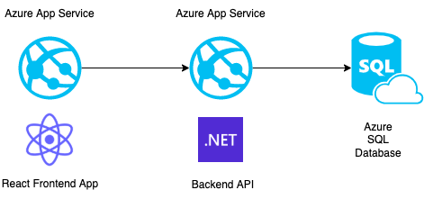

# Women Who Code Frontend & Cloud Workshop Series

This is a full stack sample application used for a workshop series hosted by Women Who Code Frontend & Cloud track to walk through deploying a web application to the cloud.

## Sample Application Architecture

- Frontend - React (this was a Hacktoberfest project by WWC Frontend - https://github.com/frontendstudygroup/frontendstudygroup.github.io)
- Backend API - .NET 6
- Database - SQL Server

## Tools for local development

- Visual Studio Code - https://code.visualstudio.com/
    - Extensions:
        - C# extension from Microsoft (ms-dotnettools.csharp)
        - SQL Server from Microsoft (ms-mssql.mssql) - if you want to connect to SQL Server
- .Net 6 SDK - https://dotnet.microsoft.com/en-us/download 
- Entity Framework CLI - https://docs.microsoft.com/en-us/ef/core/cli/dotnet 
- Azure CLI - https://docs.microsoft.com/en-us/cli/azure/ 
- Nodejs - https://nodejs.org/en/
- Docker Desktop (if you want to run SQL Server locally)
    - [Click here for instructions to run SQL Server as a docker container](https://docs.microsoft.com/en-us/sql/linux/quickstart-install-connect-docker)

## Running the application on your local machine

It is possible to run the full application on your machine after you have installed the tools above and cloned this repository to your machine.

> The commands below assume you are in the root of this repository.

### Initial set up of the database

**Run SQL Server locally using Docker**

If you have not pulled the Docker image for SQL Server, run the command below:

```
docker pull mcr.microsoft.com/mssql/server:2019-latest
```

```
docker run -e 'ACCEPT_EULA=Y' -e 'MSSQL_SA_PASSWORD=YourStrong@Passw0rd' \
  -p 1433:1433 -h sq11 --name sql1 -v sqlvolume:/var/opt/mssql \
  -d mcr.microsoft.com/mssql/server:2019-latest
```
> The connection string that points to this database server in the Docker container is in the `appsettings.Development.json` file in the `api` folder under `ConnectionStrings`.

**Create database for the API**

Once you have SQL Server database running locally, you can run the following command to execute the Entity Framework database migrations against the database to create the schema and populate data.
```
cd api
dotnet ef database update
```
> This requires the install of [Entity Framework CLI](https://docs.microsoft.com/en-us/ef/core/cli/dotnet) mentioned in the tools above.

### Run the .NET API locally

```
cd api
dotnet run
```
Then navigate to http://localhost:7071/swagger in your browser to get to the Swagger page for the API dpcumentation.

Or instead, you can click F5 in Visual Studio Code to run with debugging that will build the project, run it and launch the browser for you. You can then debug and set breakpoints in the code.

> By default the API is set up to connect to a local SQL Server database, so it will error if you run this before setting up your database. In `Program.cs` there is commented out code that you can use to connect to an in-memory database instead.

### Run the React app locally

```
cd ui
npm start
```

## Deployment to Azure

There are two services we can use in Azure to deploy the applications and the database.

- The frontend React app and the backend .NET API can be hosted in [Azure App Service](https://azure.microsoft.com/en-us/services/app-service/).
- The database can be hosted using [Azure SQL](https://azure.microsoft.com/en-us/products/azure-sql/) - a managed service for SQL Server database in Azure

> There are other ways to web applications like [Azure Static Web Apps](https://azure.microsoft.com/en-us/services/app-service/static/) which will be covered later in a separate section.



Visual Studio Code has an [Azure App Service extension](https://marketplace.visualstudio.com/items?itemName=ms-azuretools.vscode-azureappservice) we will use to do the deployments. Later we will see how to do this using a Continuous Integration & Deployment tool like GitHub Actions.

